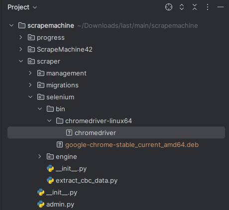

# scrapemachine
**Scrapemachine** is a Django-based application designed for automated web scraping from multiple websites. It leverages **Docker** as a container platform, **PostgreSQL 16** as a database management system, and **Gunicorn** as the WSGI server to handle web requests.

## Purpose of the Project

The main goal of Scrapemachine is to provide a flexible and scalable platform for data extraction from various websites. The target websites must be registered via the Django Admin interface in the Websites model, making it easy to manage and track data sources.

## Model Structure

### scraper/models.py
```python
class Website(models.Model):
    site_name = models.CharField(max_length=300)
    url = models.URLField(max_length=500)

    def __str__(self):
        return self.site_name

    class Meta:
        verbose_name = 'Website'
        verbose_name_plural = 'Websites'
```
The Website model stores information about the websites from which data will be scraped, including the site’s name and URL.
```python
class Property(models.Model):
    post = models.OneToOneField('progress.Posts', on_delete=models.CASCADE)
    property_name = models.CharField(max_length=100, verbose_name='Name')
    property_price = models.CharField(max_length=100, verbose_name='Price')
    property_address = models.CharField(max_length=200, verbose_name='Address')
    property_url = models.URLField(max_length=500, verbose_name='Detail URL')

    def website_name(self):
        return self.post.website.site_name

    def __str__(self):
        return self.property_name

    class Meta:
        verbose_name = 'Property'
        verbose_name_plural = 'Properties'
```
The Property model links each extracted property with a Post, storing details such as the property’s name, price, address, and detail URL.

### progress/models.py
```python
class Posts(models.Model):
    website = models.ForeignKey('scraper.Website', on_delete=models.CASCADE)
    post_title = models.CharField(max_length=100)
    post_content = models.TextField()
    date = models.DateTimeField(default=timezone.now)

    def __str__(self):
        return self.post_title

    class Meta:
        verbose_name = 'Post'
        verbose_name_plural = 'Posts'
```
The Posts model contains information about the scraped posts from registered websites. Each post is linked to a Website and includes a title, content, and date.

## System Functionality

- The Website model contains Posts, and each Post is associated with a Property.
- The system checks if a post already exists before saving it to the database, preventing duplicate entries.
- Users can add new websites through the Django Admin interface, allowing the platform to expand its sources flexibly.

### Technologies Used

- Django: Web development framework.
- Docker: Container platform for packaging the application.
- PostgreSQL 16: Relational database management system.
- Gunicorn: WSGI server to handle web requests.

## Setup and Execution Steps

### Before Building the Docker Container

1. Download this version of [Google Chrome](https://drive.google.com/file/d/1rz7OJAoFAw8rzs5f683Pv19B43lvwHaV/view?usp=sharing) and place it in the following path: `root_folder/scraper/selenium/bin/google-chrome-stable_current_amd64.deb`.



2. Create a .env file in the root of the project with the following environment variables:

```text
DATABASE_HOST=127.0.0.1
POSTGRES_USER=your_postgres_user
POSTGRES_PASSWORD=your_password
POSTGRES_DB=scraperdb
POSTGRES_PORTS='5432:5432'
POSTGRES_PORT=5432
DJANGO_PORTS='8000:8000'
DJANGO_PORT=8000
POSTGRES_HOST=db
DJANGO_SECURITY_KEY=django_secret_key
DJANGO_DEBUG=False
```
<details>
#### Django and PostgreSQL Configurations in `settings.py`

In the `settings.py` file, database configurations are managed using the environment variables:

```python
DATABASES = {
    "default": {
        "ENGINE": "django.db.backends.postgresql_psycopg2",
        "NAME": os.getenv('POSTGRES_DB'),
        "USER": os.getenv('POSTGRES_USER'),
        "PASSWORD": os.getenv('POSTGRES_PASSWORD'),
        "HOST": os.getenv('POSTGRES_HOST'),
        "PORT": os.getenv('POSTGRES_PORT'),
        "ATOMIC_REQUESTS": False,
    }
}
```
#### This is Docker Current Configuration

In the `docker-compose.yml` file, the database is configured as follows:

```yaml
db:
  image: postgres:16-alpine
  healthcheck:
    test: ["CMD-SHELL", "pg_isready -U ${POSTGRES_USER}"]
    interval: 5s
    timeout: 5s
    retries: 5
  volumes:
    - postgres_data:/var/lib/postgresql/data
  restart: always
  environment:
    - DATABASE_HOST=${DATABASE_HOST}
    - POSTGRES_USER=${POSTGRES_USER}
    - POSTGRES_PASSWORD=${POSTGRES_PASSWORD}
    - POSTGRES_DB=${POSTGRES_DB}
  ports:
    - ${POSTGRES_PORTS}```
```
</details>

### Running the Application

1. Build and run the containers using Docker:
```bash
docker-compose up --build
```
2. Create a superuser to access the Django admin panel:
```bash
docker exec -it web /bin/bash
```
Once inside the container, run:
```bash
python manage.py createsuperuser
```
3. Access the application at:
```text
http://127.0.0.1:8000/
```
4. Intoduce your credentials to access the Django Admin interface:
5. Extract data
